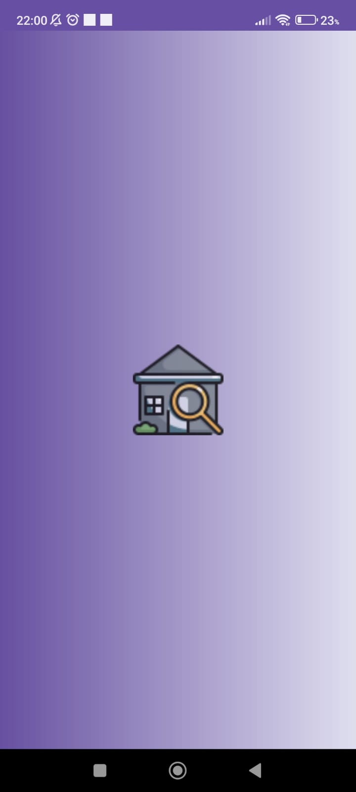
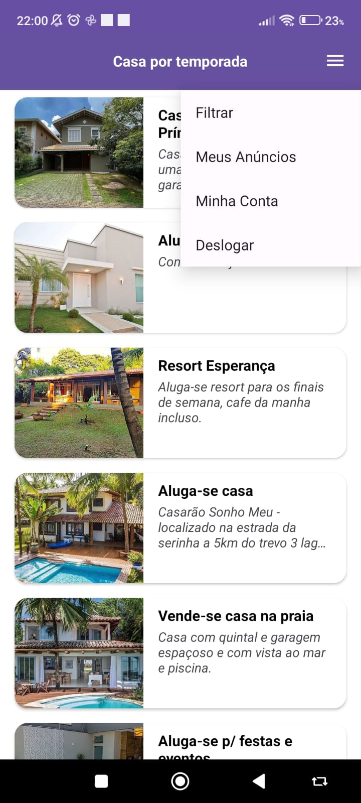
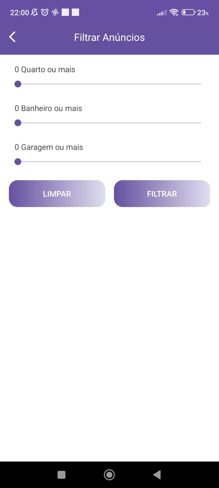
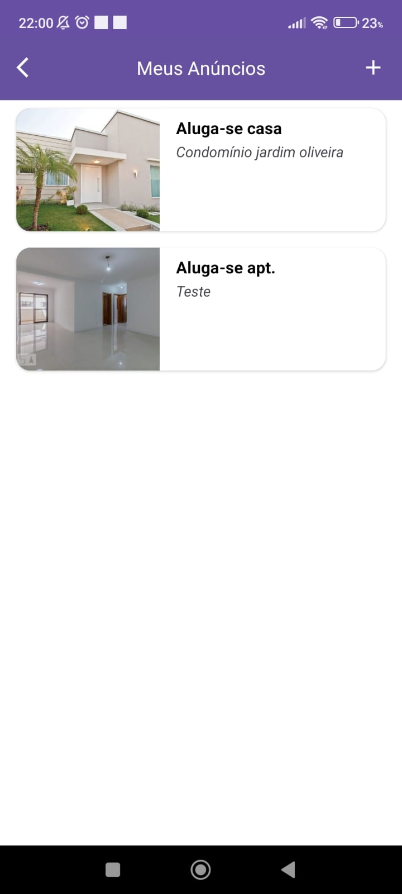
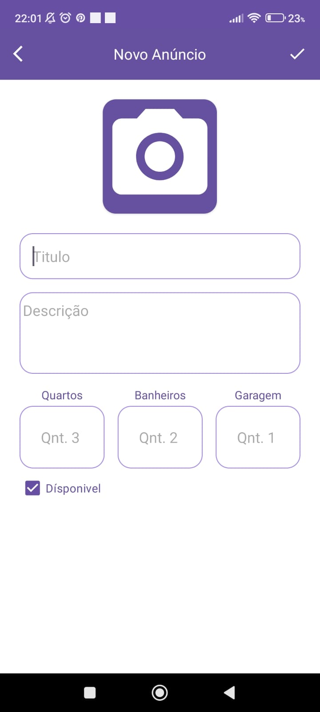
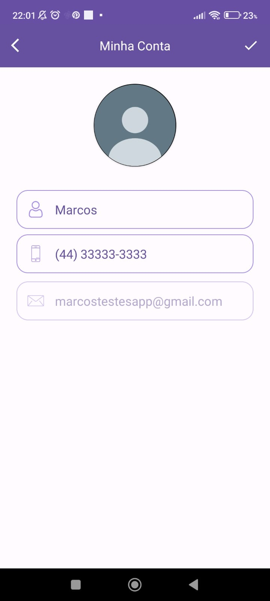

<h1>🏠 Casa por Temporada </h1>

Projeto para simplificar a experiência do usuario de encontrar e reservar casas por temporada usando framework Firebase 

<h1>📸 Screenshots</h1>

   
  
  
  
  
  
  
  
  

<h1>🖥️ Tecnologias</h1>

  ● Java  

  ● Armazenamento de Dados local
   - Firebase Realtime Database
   - Firebase Storage
   - Autenticação via E-mail
   - Recuperação de senha via E-mail (FirebaseHelper)

  ● Componentes de UI
   - TextView 
   - EditText
   - ImageView
   - SeekBar 
   - Buttons 
   - CardView 
   - ImageButton

  

  ● ViewGroup
    - LinearLayout
    - ConstraintLayout 
    - ScrollView

  ● FindViewById para recuperar components de UI

  ● Toast para display de mensagens

  ● Button para abrir tela de discagem do anuncio usando o telefone cadastrado pelo usuário

  ● AlertDialog avisando o usuário que não esta autenticado

<h1>✨ Funcionalidades Aplicadas</h1>

  ● Swipe para deletar anuncios em "Meus Anuncios"

  ● Modelo de discagem de telefone em "Criar conta" 

<h1>🎓 Author</h1>

 Marcos Vinicius Onofre (follow me on  <a href="https://www.linkedin.com/in/marcos-onofre-3263b6240/">Linkedin</a>)

